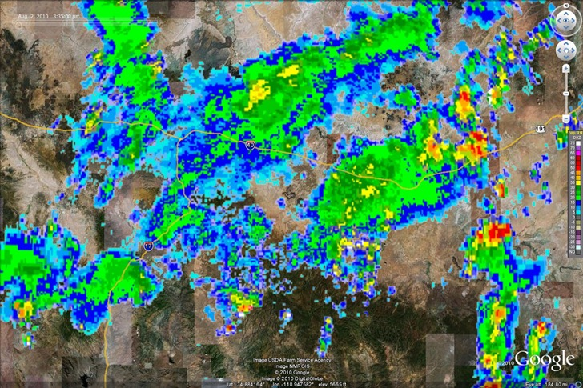
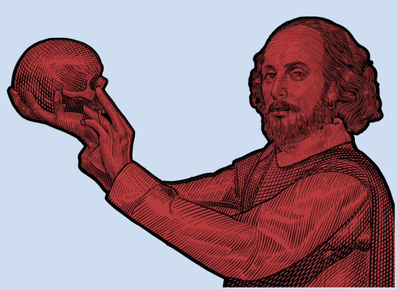

<style>
/* Add the CSS for the typing animation */
@keyframes typing {
    from { width: 0; }
    to { width: 100%; }
}

@keyframes blink-caret {
    from, to { border-color: transparent; }
    50% { border-color: black; }
}

.typing-animation {
    font-size: 24px;
    white-space: nowrap;
    overflow: hidden;
    border-right: 3px solid;
    width: 0;
    animation: typing 6s steps(50, end), blink-caret .75s step-end infinite;
    animation-fill-mode: forwards; /* Ensure the animation stays at the end state */
    margin: 20px auto;
    display: inline-block;
}

/* Add styles for the filter input */
.filter-input {
    margin: 20px 0;
    padding: 10px;
    font-size: 16px;
}

/* Add styles for the filter icons */
.filter-icon {
    cursor: pointer;
    margin: 5px;
    font-size: 24px; /* Adjust size as needed */
    color: #007bff; /* Change color as needed */
}

/* Add styles for the filter button bar */
.filter-button-bar {
    display: flex;
    flex-wrap: wrap;
    margin: 20px 0;
}

.filter-button {
    cursor: pointer;
    margin: 5px;
    padding: 8px 12px;
    font-size: 14px; /* Smaller font size */
    color: #007bff; /* Text color */
    background-color: white; /* Button color */
    border: 1px solid #007bff;
    border-radius: 5px; /* Rounded corners */
    transition: background-color 0.3s;
}

.filter-button.selected {
    background-color: #0056b3; /* Darker shade for selected state */
    color: white;
}

.filter-button:hover {
    background-color: #0056b3; /* Darker shade on hover */
    color: white;
}

/* Add styles for the contribution list */
#contribution-list {
    list-style-type: none; /* Remove default list styling */
    padding: 0; /* Remove padding from the list */
    margin: 0; /* Remove margin from the list */
}


.contribution-image {
    width: 150px; /* Set a fixed width for images */
    height: 150px; /* Set a fixed height for images */
    object-fit: cover; /* Maintain aspect ratio and cover the area */
    margin-right: 10px; /* Space between image and text */
    border-radius: 5px; /* Optional: rounded corners for images */
    padding: 0; /* Remove padding from images */
}

.contribution-item {
    display: flex; /* Use flexbox for alignment */
    align-items: flex-start; /* Align items at the start */
    margin-bottom: 10px; /* Space between items */
}

.project-details {
    margin-left: 10px; /* Add space between image and text */
    flex-grow: 1; /* Allow text to take available space */
    max-height: 150px; /* Set a maximum height for the text container */
    overflow: hidden; /* Hide overflow text */
}

.project-details p {
    margin: 2px 0; /* Reduce margin for the description */
    overflow: hidden; /* Prevent overflow */
    text-overflow: ellipsis; /* Add ellipsis for overflow text */
    display: -webkit-box; /* Use a box layout */
    -webkit-box-orient: vertical; /* Set orientation to vertical */
    -webkit-line-clamp: 3; /* Limit to 3 lines */
}

.project-details .project-date {
    margin: 5px 0; /* Reduce margin for the date */
}

.project-details .like-button {
    margin-top: 5px; /* Add a small margin for the like button */
}
/* Add styles for small icons */
.small-icon {
    width: 20px; /* Set a fixed width for small icons */
    height: 20px; /* Set a fixed height for small icons */
    margin-right: 5px; /* Space between icon and text */
    vertical-align: middle; /* Align icon with text */
}

.icon-list {
    display: flex;
    flex-direction: row;
    align-items: center;
    margin-top: 5px;
}

</style>
<div class="typing-animation" id="typing-text"></div> <!-- Add the typing animation -->
<script>
    // Function to handle typing animation
    function typeText(text, duration) {
        document.getElementById("typing-text").textContent = text;
        document.querySelector('.typing-animation').style.borderRight = '3px solid'; // Reset caret
        setTimeout(function() {
            document.querySelector('.typing-animation').style.borderRight = 'none';
        }, duration); // Match the duration of the typing animation
    }
    var text1 = "welcome to my journal...";
    typeText(text1, 4000); // Duration for the first text
    // Execute the second text after the first one completes
    setTimeout(function() {
        var text2 = "some thoughts, some projects.";
        typeText(text2, 4000); // Duration for the second text
    }, 4000); // Match the duration of the first text
</script>

<hr>
<!-- Filter Button Bar -->
<div class="filter-button-bar">
    <button class="filter-button" onclick="toggleFilter(this, 'Reinforcement Learning')">Reinforcement Learning</button>
    <button class="filter-button" onclick="toggleFilter(this, 'LLMs')">LLMs</button>
    <button class="filter-button" onclick="toggleFilter(this, 'Paper Implementations')">Paper Implementations</button>

</div>
<ul id="contribution-list">
    <li data-tags="Reinforcement Learning, Paper Implementations" class="contribution-item">
        <a href="projects/three_climate_experiment.html">
             <!-- Image for the project -->
        </a>
        <div class="project-details">
            <h3><a href="projects/three_climate_experiment.html">The Three Climate Experiment</a></h3> <!-- Title -->
            <p>Agentic building management systems in PyTorch.</p> <!-- Short description -->
            <p>Adapting novel DRL training framework for extreme weather.</p> <!-- Short description -->
            <span class="project-date">Date: May-October '24</span> <!-- Date placeholder -->
            <div class="icon-list">
                
                 
                 
            </div>
        </div>
    </li>
        <li data-tags="LLMs, Paper Implementations" class="contribution-item">
        <a href="projects/silly-shakespeare">
             <!-- Image for the project -->
        </a>
        <div class="project-details">
            <h3><a href="projects/silly-shakespeare">TinyShakespeare GPT</a></h3> <!-- Title -->
            <p>A Shakespearean tragedy generator using a decoder-only transformer.</p>
            <p>Built from scratch, outputs for entertainment purposes only.</p> 
            <span class="project-date">Date: December '24</span> <!-- Date placeholder -->
            <div class="icon-list">
                
                 
            </div>
        </div>
    </li>
    <li data-tags="Reinforcement Learning" class="contribution-item">
         <!-- Image for the project -->
        <div class="project-details">
            <h3>Sold by RL</h3> <!-- Title -->
            <p>Optimising pricing strategies based on customer and competitor behaviour.</p> <!-- Short description -->
            <p>Use agents to dynamically adjust pricing and inventory.</p> <!-- Short description -->
            <span class="project-date">Date: In Progress</span> <!-- Date placeholder -->
            <div class="icon-list">
                
                 
            </div>
        </div>
    </li>

    
</ul>
## publications

```
- TODO
```

<script>
    var selectedTags = [];

    function toggleFilter(button, tag) {
        button.classList.toggle('selected'); // Toggle selected class
        if (selectedTags.includes(tag)) {
            selectedTags = selectedTags.filter(t => t !== tag); // Remove tag if already selected
        } else {
            selectedTags.push(tag); // Add tag if not selected
        }
        filterContributions();
    }

    function filterContributions() {
        var list = document.getElementById("contribution-list");
        var items = list.getElementsByTagName("li");

        for (var i = 0; i < items.length; i++) {
            var tags = items[i].getAttribute("data-tags").toLowerCase();
            if (selectedTags.length === 0 || selectedTags.some(tag => tags.includes(tag.toLowerCase()))) {
                items[i].style.display = ""; // Show item
            } else {
                items[i].style.display = "none"; // Hide item
            }
        }
    }
</script>
